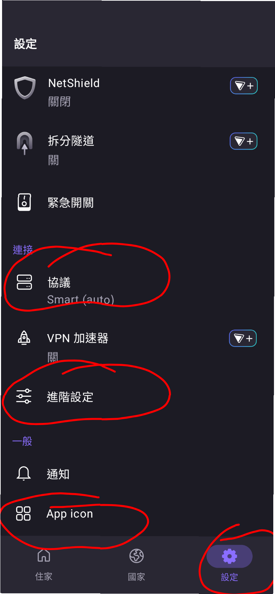
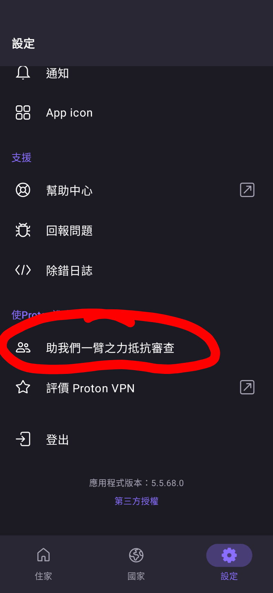
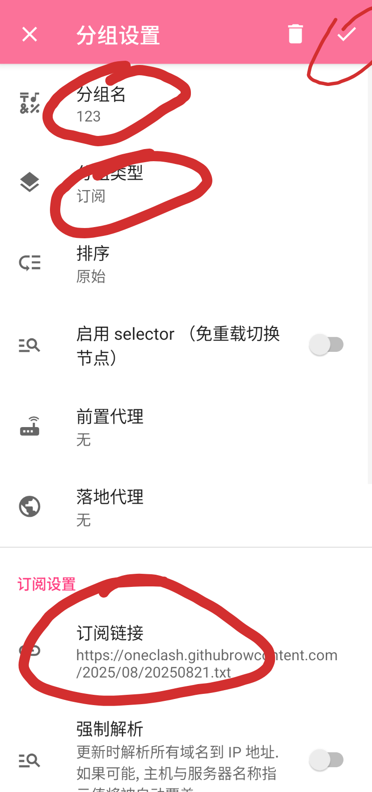
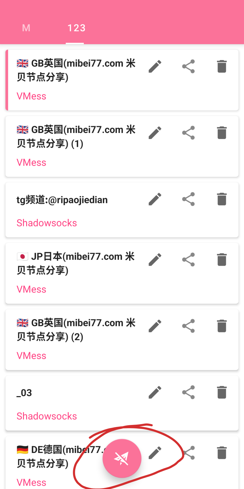
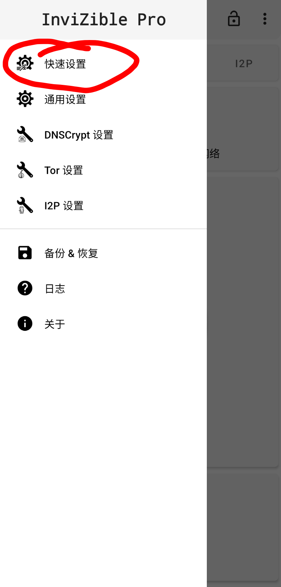
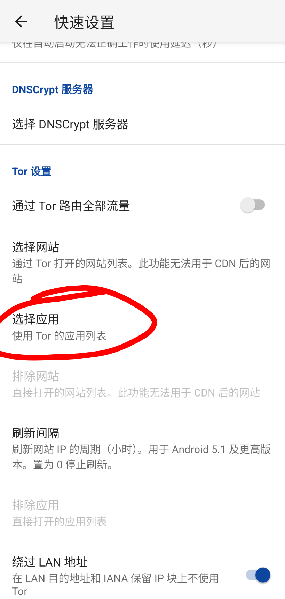
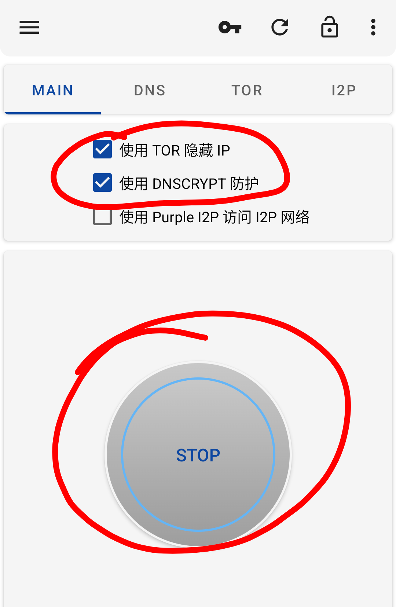
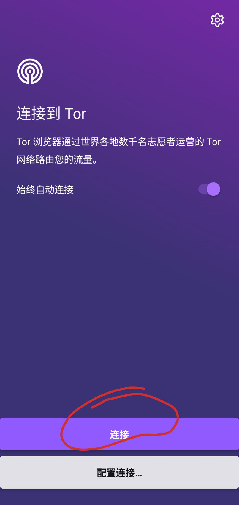
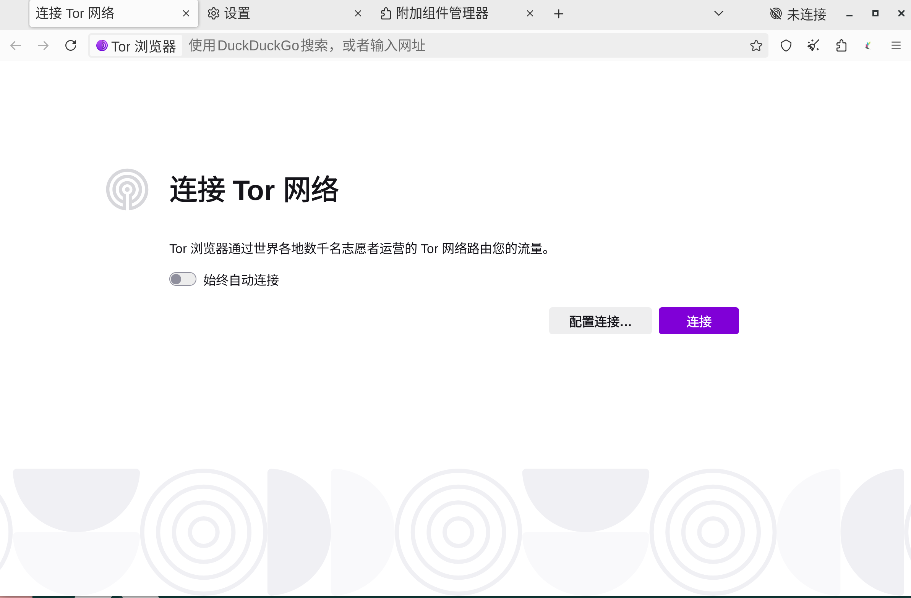
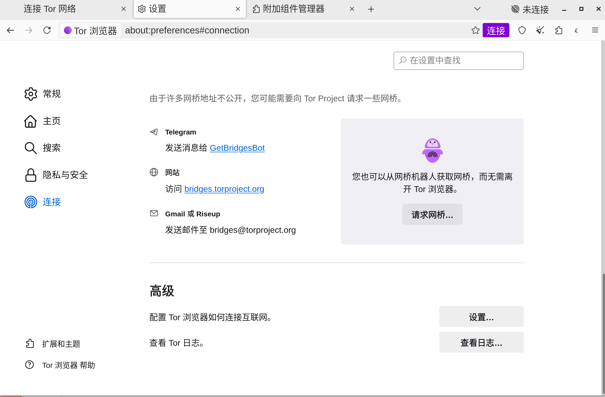

全平台自由开源免费连接国际互联网教程         


<details>    

<summary><code><strong><font color="red"><font size="6">前言『点击展开』</font></font></strong></code></summary>  

#### &ensp;&ensp; 本网站/项目提供的任何资源教程搜集来自网络分享，非原创，仅用于教学测试和科学研究的目的，请在测试研究后的24小时内删除，切勿传播。假如你使用了本网站/项目提供的资源教程，请遵守所在国的法律法规，切勿用于涉及政治宗教色情犯罪等领域发布违法言论以及任何非法用途，同时请勿分享到中国大陆商业网络平台。上面一切违法行为造成的不良后果请自负。==
               
      
#### &ensp;&ensp;下列软件均可在上方文件区免代理下载（仅方便不能初始代理的用户下载，版本更新不会快，最新版本安装请自行连接国际互联网后去推荐的官方网址下载或更新，有条件的最好验证签名或者哈希值确保下载过程中不被动手脚，有能力者最好自己从源代码拉取编译打包）     

#### ==特别提醒==： 不安全的代理/vpn节点可能会泄漏连接日志，向当地有关部门妥协主动或者被动提交，或者直接受控制（包括控股/钓鱼/所属），不安全的非开源vpn/代理软件客户端因其高权限特性还会对设备除网络连接外进行额外监控，替换上网加密证书等操作导致用户设备全透明。因此首先要确保vpn/代理软件本身开源（代码开源可以公开审查），其次尽量保证使用节点本身可靠，可控的自建节点>tor节点(多次跳转)>别人提供的付费/免费节点/vpn节点，不要相信任何商家承诺。  

</details>         


           
---   

<details>    

<summary><code><strong><font color="red"><font size="6">目录『点击展开』</font></font></strong></code></summary>  

```
目录 ：    

一.开源程序迷雾通                  
二.开源程序protonvpn 
三.nekobox/v2r/clash /singbox等自由及开源程序加机场      
1.2 临时使用非开源程序（风险较高，仅用于其他手段全部都失效时临时使用且不能用于任何敏感用途）
四.开源暗网工具tor browser/ invizible/orbot        
五.vps或其他方法自建节点或自建节点订阅使用标题三的的程序获取更高的安全性和稳定性                        
六.注意事项              
 ```    
</details> 


---    
#### [旧版图文pdf精简教程参考资料可点击此跳转](https://gitea.com/gjcxn358/go-to-word/src/branch/main/%E5%9B%BE%E6%96%87pdf%E6%95%99%E7%A8%8B) ，冲突部分以下文的新版为准                     
#### 教程软件免代理下载，安卓版[点击此跳转](https://gitea.com/gjcxn358/go-to-word/src/branch/main/%E5%AE%89%E5%8D%93%E5%BC%80%E6%BA%90%E7%89%88%E4%B8%8B%E8%BD%BD)，电脑版[点击此跳转](https://gitea.com/gjcxn358/go-to-word/src/branch/main/%E7%94%B5%E8%84%91%E7%89%88)              
                          
---   

####  教程应按顺序阅读，因为重复的内容不会多次反复提增加教程无效长度        
---

<details>    

<summary><code><strong><font color="red"><font size="6">一. 开源迷雾通 (点击此展开内容)</font></font></strong></code></summary>  
     
##  一. 开源迷雾通       
  
   
      
&ensp;&ensp; 安装开源的vpn软件geph迷雾通（文件夹内版本不一定最新，） ，并注册登陆                 
- 最新版官网  https://geph.io/zhs ，
- [geph迷雾通免代理镜像下载点击这里](https://gitea.com/gjcxn358/go-to-word/src/branch/main/%E5%AE%89%E5%8D%93%E5%BC%80%E6%BA%90%E7%89%88%E4%B8%8B%E8%BD%BD) 点击文件geph.apk,然后点击下载按钮即可下载安装  
- 打开软件点击下方的注册，注册完成点击登陆，完整迷雾通服务选择暂不就不需要付费，注意一定要点击软件内的设置按钮-分流隧道-启用应用选择-点击选择要排除的无需代理的应用-勾选无需代理的软件（根据自己的需求勾选，防止实名服务连接代理自爆使用代理服务）然后点击连接就连上了国际互联网   
操作图：    
<p>       
         
         
             
</p>       

- 迷雾通 vpn模式启用后，会在本地生成与两个代理转发端口， 其中一个端口 ip为`localhost`或也可以是`127.0.0.1`，端口为`9909`,模式为`scoks5`，，一个http端口，ip：`localhost`，端口`9910`,可在软件设置在内找到，如上面图二底部调试一栏          
支持代理设置的软件启用socks5/hppt代理访问tor网络比单纯的vpn模式更安全 ，使用vpn模式下访问软件/网站，如果invizible软件bug意外断开连接，系统杀后台，关闭软件/网站前关闭tor软件，网站/云服务会切换到直连，读取到用户真实ip导致ip泄露，在代理端口模式下，tor软件断开连接，本地代理端口不通，软件/网站就直接断网显示错误,就不会出现ip泄露。    
支持代理设置的软件目前并不多，firefox火狐浏览器及其分支如fennec可以下载插件[foxyproxy](https://addons.mozilla.org/zh-CN/firefox/addon/foxyproxy-standard/)，点击此插件设置-选项设置-proxies-模式选择socks5,ip（hostname）填写`localhost`，端口填写`9909`，然后保存，再次点击浏览器插件的foxyproxy按钮-点击添加的代理切换到迷雾通的代理 即可让火狐浏览器全局走代理模式而不是使用有断连后ip泄露风险的vpn模式 。     
xmpp软件中gajim支持代理设置，安卓端口monocles chat支持tor 9050端口的tor代理启用但迷雾通不支持端口修改所以无法使用代理模式，电报第三方客户端nekogram支持代理设置 ，fdroid应用商店支持代理设置， 安卓/linux系统都支持系统全局的代理模式，安卓在wifi设里，不过一般情况下最好不要启用，因为设置了手机所有软件都会强制走代理。   

- 教程最后编辑时间迷雾通分流分应用设置不支持只允许勾选应用访问代理的模式，排除勾选应用代理的方法难以找到所有国内软件，特别是国产系统内置的服务软件，因此最好启用分流隧道的排除中国大陆流量按钮，但是需要注意的是排除中国大陆流量有个缺陷，比如当你要使用匿名qq号代理的方式登陆qq隐藏ip时，启用此排除大陆流量后登陆的ip为真实ip，如果访问网页是大陆网页内容镶嵌有国外服务托管的中国内容或者国外服务，这样国内网页内容真实ip，内嵌的国外内容显示用户的是代理ip，就会产生身份关联暴露实名，或者一个浏览器同时打开国内网站和国外网站，国内网站带有跨站跟踪的监控服务会检测到国外网站信息产生关联（跨站cooike跟踪）            
&ensp;&ensp; 为解决这些隐患，只有一台手机的情况下，最好通过开源软件shelter/或炼妖壶，启用独立的工作空间，或者启用安卓自带的多用户/隐私空间，在里面使用代理软件和需要走代理的服务/软件，不开启排除大陆流量使用，这种方式可以将日常实名软件和文件与隐私使用的做隔离，当实名访问国内服务时用普通用户，匿名访问时用后者   ，国产安卓手机内置的系统监控程序通过多用户隔离的方式不一定靠谱，只是比不使用多用户隔离好一点，这时退出手机系统云账户，关闭ai助手/识屏服务/智慧助手/语音服务，不给软件不需要的权限，有条件的应准备第二台设备和日常设备隔离，第二台设备如果是电脑，最好安装的是国外开源linux系统，如果是平板/手机，对于安卓系统最好是能解bl锁刷机为国外开源类原生系统比如lineage/石墨烯/crdroid等，如果是苹果最好外版苹果机并登陆外区苹果账户，国内的苹果的数据都要经过大陆官方审核（云上贵州）      
- 不要访问http前缀的网页比如网址：`http://www.baidu.com`，这种不带网站tls加密，访问内容/账户密码等都会被迷雾通的服务器知道，存在泄露风险，应访问https开头的网站，比如：`https://www.baidu.com`，带有网站加密，一般情况下迷雾通的服务器不会知道内容，只知道你访问了什么网站       
- webrtc导致的真实ip泄露：webtrtc技术应用于网络音频视频实时通讯等，如果有网站冒充webrtc使用申请就可以获取到用户真实ip导致ip泄露，因此一般情况下需要主动禁用webrtc，在有通讯需要的时候在手动启用，禁用webrtc，建议使用[开源的firefox火狐浏览器国际版](https://www.firefox.com/en-US/download/all/)或其分支[安卓版fennec](https://f-droid.org/en/packages/org.mozilla.fennec_fdroid/)/librewolf（电脑版）等，安装webrtc屏蔽插件进行屏蔽，比如插件[Disable WebRTC](https://addons.mozilla.org/zh-CN/firefox/addon/happy-bonobo-disable-webrtc/)     ,同时不要使用电报（本身安全性较差被各国监控和泄露严重）的默认设置通话服务服务-也会调用webrtc泄露真实ip，如果要使用电报通话，可以使用第三方开源电报软件 nekogram（github下载），设在中找到proxy setting,设置socks5代理（server填写本地的localhost，prot填写迷雾通的proxy端口9909），保存切换到此代理，然后启用 use proxy for call，这样进行电报通话，电报服务器无法知道用户真实ip                                      
- 不应该只学习一种翻墙方式，因为有可能会失效，至少学两三种做备用                

&ensp;&ensp; 优缺点分析     
优点：免费稳定，使用简单，缺点：免费版限速，文字图片浏览勉强还行，据其他人反馈，有在校园网（校园网有专门的服务器监控学生上网服务并识别常见梯子）使用迷雾通被喝茶的案例                                              
##### 迷雾通linux版本安装:
- [官网下载](https://geph.io/zhs)后缀为`.flatpak`的迷雾通安装包linux版，次过程需要使用代理，如果电脑没有，那就在手机上下载好以后导入到电脑里，也可以[免代理下载上面文件夹里面的旧版](https://gitea.com/gjcxn358/go-to-word/src/branch/main/%E7%94%B5%E8%84%91%E7%89%88)                                
确保linux电脑里有flatpak软件，在下载目录鼠标右键从此处打开终端，将终端app界面最大化防止后面的id遮挡，然后输入`flatpak install ./迷雾通包名（含后缀）`。然后输入`flatpak list `罗列所有flatpak软件。找到迷雾通`GephGui`那一行旁边的应用程序id并复制，然后输入`flatpak run 迷雾通的应用完整ID`启动软件，注册后即可使用，在其设置内开启vpn模式可以让系统全局走代理。如果系统桌面为kde或者gnome,应该会在开始菜单自动生成启动快捷方式，通过查看迷雾通设置里面的代理本地ip和端口号可以也实现系统代理或者应用代理（支持设置代理的应用）                
- 如果linux电脑里面没有flatpak,就需要手动安装，[安装教程参考此](https://cn.linux-console.net/?p=20741)                                   

             

   

</details>    

                    
--- 


<details>    

<summary><code><strong><font color="red"><font size="4">二. 开源protonvpn  </font></font></strong></code></summary>   
  
## 二. 开源protonvpn

   
   ---                     
&ensp;&ensp;提醒：此应用免费版只能全局vpn,不能让部分应用绕过，因此如果设备是非纯国外系统以及登陆了实名账户（国产改版安卓比如oppo/vivo/小米手机默认系统不算纯国外系统），不是很建议使用，国外系统如果安装了国产非自由开源应用，应使用shelter/炼妖壶开启工作空间进行和其他应用的环境隔离，或者使用自带的多应用/隐私空间隔离，将pn软件和需要使用vpn的软件装进去使用                                                                        
https://f-droid.org/packages/ch.protonvpn.android/           
fdroid自由软件商店内搜索下载）注册登陆使用不限速安全节点 （protonvpn注册需要连国际互联网 ）                          fdroid 官网：https://f-droid.org/    
下载安装后注册proton账户登陆使用，此过程需要先连上其他代理。    
软件设置-应用图标-改为天气/便签/计算器 进行应用伪装 
和我们一起对抗审查-关闭数据收集和上传                     
自动模式连接优先为wireguard协议，此协议加密型高但是无流量混淆特征很明显，容容易被墙，优点是速度快，为了更加安全和稳定可以在设置协议手动切换到自研的steath协议 。      
<p>       
       
    
   
    
 
         
 
</p>                   

- linux版本的protonpn 教程最后编辑时间不支持steath协议，难以连接上           


</details>          
                                                         
 ---   
     
<details>    

<summary><code><strong><font color="red"><font size="4">三. nekbox/v2r/clash /sinbox等自由及开源代理程序加机场 </font></font></strong></code></summary>

## 三. nekbox/v2r/clash /sinbox等自由及开源代理程序加机场    
          
&ensp;&ensp; 优点：软件自由开源，可以使用别人搭建的节点也可以自己搭建节点  ，只要是正常tls加密，节点一般不能破解用户加密流量只可能记录真实ip和真实访问地址        
&ensp;&ensp; 缺点：非自建的机场节点不一定可靠（可能记录日志并泄漏ip），非自建节点（不管是付费还是免费）都可能存在高峰期拥堵网速慢不稳定的情况，购买的付费机场可能随时跑路或者本身搭建技术不过关挑选的vps有问题所以有风险，别人搭建的免费节点也好不到哪里去，自建节点请看标题5   ，同时避免使用中国包括香港和澳门的节点               
- [点击上方README.md上面的安卓开源版文件夹内的的nekobox.apk/v2r/clash/singbox/迷雾通/protonvpn](https://gitea.com/gjcxn358/go-to-word/src/branch/main/%E5%AE%89%E5%8D%93%E5%BC%80%E6%BA%90%E7%89%88%E4%B8%8B%E8%BD%BD)  
---   
- [电脑版免代理下载请点击此](https://gitea.com/gjcxn358/go-to-word/src/branch/main/%E7%94%B5%E8%84%91%E7%89%88)  
- 然后点击下载按钮下载并安装 ，苹果用户看后文                
   
&ensp;&ensp;这里以nekbox-[NB4A安卓版为例（点击免代理下载）](https://gitea.com/gjcxn358/go-to-word/src/branch/main/%E5%AE%89%E5%8D%93%E5%BC%80%E6%BA%90%E7%89%88%E4%B8%8B%E8%BD%BD)进行说明：  （clash/v
2r/singbox使用方法类似）         
此软件 [最新版官方下载地址](https://github.com/MatsuriDayo/NekoBoxForAndroid/releases)             
同类：          
- [v2rayng](https://github.com/2dust/v2rayNG/releases)  -支持安卓设备，更新维护比nekbox积极      

- [v2raya](https://v2raya.org/)-支持电脑设备，包括windows,linux等             
- [v2rayn](https://github.com/2dust/v2rayN)-支持win/mac/linux,win下载带core核心的64位，linux下载zip压缩包赋予运行权后运行，参考他的说明   
                        
- [clash-meta](https://github.com/MetaCubeX/ClashMetaForAndroid)  -安卓,clash使用的订阅为yaml而不是下面教程的txt）        
- [clash-verge-rev](https://github.com/clash-verge-rev/clash-verge-rev)  -电脑设备     
-  [Clash Nyanpasu](https://github.com/libnyanpasu/clash-nyanpasu)               -电脑设备     

- [flclash](https://github.com/chen08209/FlClash)-支持电脑安卓手机和电脑设备,或者在fdroid应用商店内下载                                 
- [sing-box](https://github.com/SagerNet/sing-box)-支持安卓和苹果以及各种电脑系统      
- [hiddify](https://github.com/hiddify/hiddify-app)       推荐，支持安卓和苹果以及电脑系统包括linux（电脑上支持vpn模式-需要root权限）    ，支持协议最多，订阅同时支持v2r/clash         
- [karing](https://github.com/KaringX/karing)-支持苹果/安卓/windows,支持v2r/clash/singbox订阅，支持ip/dns泄露检测/dns加密（doh）   /tls/https3等 ， [开源许可协议见此](https://github.com/KaringX/karing/blob/main/LICENSE.md)             
- [苹果手机请换区后使用sinbox](https://apps.apple.com/us/app/sing-box/id6451272673?l=zh-cn&platform=iphone ) ，或者使用ios版v2r- OneClick ，    
苹果手机其他客户端比如： Karing、Hiddify Proxy & VPN、Shadowrocket(小火箭)、Streisand、v2box           

- 软路由Openwrt：homeproxy    

--- 
然后打开 下面 订阅网站网站（选一个能打开的 ）  ：         
                                
- 普通节点分享网站：  
           
https://wenode.cc/                   
https://v2rayshare.com/                  
https://onenode.cc/    
https://clashgithub.com/                  
- github开源代码托管平台的项目：（比上面网站的稳定靠谱，使用稍微复杂一点）                      
    
https://github.com/chengaopan/AutoMergePublicNodes          
https://github.com/Barabama/FreeNodes         （这个是爬虫github其他人分享节点项目的项目）     
https://github.com/mahdibland/V2RayAggregator   
https://github.com/aiboboxx/v2rayfree                                       
https://github.com/free18/v2ray      
也可以在github搜索关键词 free v2r 按时间排序，找到其他人分享的公开节点                                  
- 获取节点的电报群示例：     
 https://t.me/zhibeii    （下载导入txt内的所有链接）          
.......           
##### 使用教学：   
- 首先需要特别注意的是：上面分享的节点订阅网站的节点均为互联网公开分享的，相比自建节点，安全性一般，也无法审查是否为钓鱼节点或者是否泄漏连接使用日志，因此连接以后不要访问http前缀的网站（目标网站不带加密，内容对于节点服务器来说是完全透明的，包括账户密码，比如http：//bing.com），应只访问带加密的https前缀的网站(目标网站内容自带tls加密，节点服务器解密代理协议后也无法查看真实内容，只知道你的ip，比如https：//bing.com)，可以在火狐浏览器安全设置中开启仅访问https网站 ,同时建议经常性切换节点或者每次使用不一样的节点，减少长时间使用到钓鱼节点或者泄漏日志的节点时被跟踪的时间。     正式使用前请在代理软件设置内勾选分应用代理，选择需要代理的应用或者绕过不需要代理的应用，避免实名服务使用代理自爆翻墙。最好使用代理软件的全局模式而不是规则模式，关闭绕过大陆局域网等，避免出现规则漏洞或者绕过漏洞泄漏真实ip， 注意身份隔离使用代理翻墙的应用软件不要登陆任何实名用户包括绑定国内邮箱和手机号，这泄漏个人隐私，如果需要同时访问国国内国外服务（或者一个需要实名，一个需要匿名），应准备两个国外浏览器，一个勾选允许代理访问国外/匿名，一个不勾选代理访问国内/实名，最好是准备两部设备，一台用于翻墙（比如谷歌手机/苹果手机海外版/三星手机海外版/其他海外手机海外版/国内手机但是刷入了国外系统的手机/搭载国外版操作系统的电脑或笔记本，且需要翻墙服务所在的设备用户空间内无其他国产软件-大部分系统都可以开启多个账户用于隔离应用），一台不翻墙（普通日常工作设备）。如果只有一台设备最好开启系统多用户/隐私模式/虚拟机，在其中使用翻墙服务和主用户的软件隔离                                                      
- 以普通网站获取节点为例，代理软件以nekobxo为例，选择最新日期的帖子  进去，找到订阅链接 —v2ray订阅链接:复制订阅链接        
比如  ：https://node.wenode.cc/2023/05/20230501.txt      


操作图：    
<p>           
          
   
   
   
   
   
            
       
</p>    
clash/rayng/v2rayn的操作和nekobbox比较接近，不做单单独介绍，不同的是clash一般只能倒入clash订阅，不能倒入v2ray订阅，模式需要选择全局模式 ，电脑v2rayn需要选择全局模式，clash只能导入节点订阅或将节点文件，v2rayn/v2rayng/nekobox/hiddify/karing 既可以直接导入支持的订阅，有可以直接导入单/多节点链接。             
nekobox操作文字说明：           
- 打开 nekbox  点击左上侧三横 -分组  -添加分组- 分组类型-订阅（下方会刷新出来订阅设置）   ，再点击订阅链接 -粘贴上面的链接 ，分组名随意  ，然后勾选保存
- 点击左上侧三横-路由-关闭中国域名绕过和中国ip绕过规则，点击设置-关闭绕过局域网-开启分应用代理-点击不代理的应用，勾选无需代理的所有应用，如果是国产系统，应选择仅代理勾选应用模式并勾选需要代理的应用    
- dns设置-远程和本地dns改为cloudfire加密域名解析“ https://1.1.1.1/dns-query ”或谷歌加密域名解析 ”https://dns.google/dns-query”    ，
- 关闭dns路由,开启fakedns  
- 返回首页  点击右侧 三点 -连接测试-url test 测试完成后可以在节点出看到ms延迟信息 ，排序-按延迟排序              
- 点击 选择延迟较低的 节点   点击下方 的飞机图标即可连接   连接好以后 在飞机图标下方  点击测试连接 ，打开浏览器，输入网址访访问国外的ip测试网站：        https://ipleak.net/    测试ip地址和dns地址是否全为国外       ，如果都为国外，就可以正常使用           

- 普通网站这种节点需要每日进订阅网站订阅  更换订阅 地址               
更换方式为 点击  进入订阅网站 ，点击最新帖子  ，找到最新订阅地址 ，然后复制            
- NEKBOX/v2r/clash软件内  再次打开分组  之前添加的分组 点击编辑图标，然后在订阅设置里面更换订阅 并保存  ，回到分组  点击 更新  即可刷新节点      

- **此类免费订阅网站不少 ，可以打开       
https://search.pub.solar/search         
开源搜索 ，搜索 关键词    v2r 免费订阅   

- 对于github上面的节点，很多都是可以自动更新的，只需要定时刷新订阅即可，有些原生订阅会被墙，这类如果提供了反代订阅/套cdn的转换订阅/加速订阅的，可以用来绕过墙，比如上面的项目  https://github.com/chengaopan/AutoMergePublicNodes       ,网站项目里面这段：        

```
添加 Base64 订阅：    
    原始链接      
    JsDelivr 反代（zzko.cn）            
    JsDelivr Fastly CDN       
    JsDelivr Cloudflare CDN       
    JsDelivr GCore CDN      
    KKGithub        
    FastGit       
以下加速链接可能无效：       
    KGithub           
    
```
原始链接下面套cdn的都可以绕墙  ，长按/右键复制其对应链接导入对应客户端,比如该项目提供的couldfire cdn加速的v2r订阅地址：                 
`https://testingcf.jsdelivr.net/gh/chengaopan/AutoMergePublicNodes@master/list.txt    `     ，
刷新节点连接使用（可以设置订阅刷新时间或者定时手动去刷新）
- 也可以在github上搜索其他节点分享项目 ，关键词比如 `v2r免费订阅`   或者`clash免费订阅`  


 
     

&ensp;&ensp; 注意：此类 公开节点来源不明（包括付费节点），不建议经常使用，最好只用于过渡使用，重点使用下面的方法  ，下面几种方法 使用可能都需要借助方法1临时连接国际互联网        
&ensp;&ensp;注意开启全局模式（而不是规则模式或绕过局域网），避免真实ip泄漏，然后勾选不代理的应用避免非自由开源实名软件走代理自爆 ，有dns防护选项的应开启dns防护，使用浏览器上网比如火狐浏览器，应该下载disable   webrtc插件，来屏蔽媒体webrtc,避免代理后真实ip泄漏               
- v2rayng/clash mate/nekobox等vpn模式启用后，会在本地生成与一个代理转发端口， ip为`127.0.0.1`，nekobox默认端口为`2090` (端口号也可在软件内修改，不同软件默认代理端口不同，可以在软件设在里面找到，v2r系列一般默认socks5端口是10808,clash一般是7890或8090等),模式为`scoks5`，也可以手动启用http模式端口，支持代理设置的软件启用socks5代理访问tor网络比单纯的vpn模式更安全 ，使用vpn模式下访问软件/网站，如果invizible软件bug意外断开连接，系统杀后台，关闭软件/网站前关闭tor软件，网站/云服务会切换到直连，读取到用户真实ip导致ip泄露，在代理端口模式下，tor软件断开连接，本地代理端口不通，软件/网站就直接断网显示错误,就不会出现ip泄露。          
支持代理设置的软件目前并不多，firefox火狐浏览器及其分支如fennec可以下载插件[foxyproxy](https://addons.mozilla.org/zh-CN/firefox/addon/foxyproxy-standard/)，点击此插件设置-选项设置-proxies-模式选择socks5,ip（hostname）填写`127.0.0.1`，端口填写`2090`，然后保存，再次点击浏览器插件的foxyproxy按钮=点击添加的代理切换到nek代理 即可让火狐浏览器全局走代理模式而不是有ip泄露风险的vpn模式 。         
xmpp软件中gajim支持代理设置，安卓端口monocles chat支持tor 9050端口的tor代理启用，v2rayng将socks5端口手动改为9050，monocles chat启用tor代理，即可让这个软件v2ryng的代理端口模式      
，电报第三方客户端nekogram支持代理设置 ，fdroid应用商店支持代理设置， 安卓/linux系统都支持系统全局的代理模式，安卓在wifi设里（类型为http而不是socks5），不过一般情况下最好不要启用，因为设置了手机所有软件都会强制走代理。          
### 1.2  非常不推荐       
&ensp;&ensp;如果上述订阅都订阅不了，且其他方法都无效的情况，那就只能使用非开源的代理软件作为第一次连接国际互联网用，比如蓝灯等，蓝灯[apkpure商店内下载](https://apkpure.com/cn/search?q=%E8%93%9D%E7%81%AF&t= )      

- 蓝灯和其他代理破解点击下载[破解代理-免代理下载](https://codeberg.org/ljggfvn217/go-to-world/src/branch/main/%E9%9D%9E%E5%BC%80%E6%BA%90%E5%8F%8A%E7%A0%B4%E8%A7%A3%E4%BB%A3%E7%90%86)  
 
&ensp;&ensp; ==特别注意==：非开源应用安全性低，破解应用更有风险（木马病毒风险），也可能存在软件记录日志和泄漏真实ip的风险，甚至可能在设备偷偷安装根证书来窃取https网站访问加密的tls数据，1.2只适用于绝对小白或其他方案在当下环境均无法使用的情况临时使用，用于获取其他开源代理或vpn软件，且不能用作任何政治用途，以及登陆个人匿名账户，使用非开源程序造成的隐私泄漏后果自   负                            
&ensp;&ensp;使用蓝灯vpn的有喝茶案例（原因未知），长期存在且完全免费免费的老王vpn等疑似钓鱼vpn,付费快连vpn听说可以在中国的企查查网站上查到企业信息（包括法人）......  经常被喝茶的翻墙人群大多喜欢使用非自由及开源程序/系统                     

</details>      
         
---   


 
<details>    

<summary><code><strong><font color="red"><font size="4">四. 使用tor洋葱网络 </font></font></strong></code></summary>

## 四. 使用tor洋葱网络        
&ensp;&ensp;优点：可以用于访问暗网，自由及开源，相比其他方案，tor的三次节点随机跳转确保追踪真实ip和加密数据比其他方式都困难，一个节点是钓鱼节点也无法完全同时掌握来源和去处，节点是公开的且任何人都可以部署分享给他人使用 ，tor浏览器可以让使用tor网络的人看起来指纹一样难以区分                         

&ensp;&ensp;缺点：各国特别是中国对tor网络的监管比较严格，节点完全开放，入口，中转和出口节点都容易被拉黑和重点检测，在局域网国家（中国伊朗朝鲜等）无法直连，只能通过不完全公开的网桥来连接，入口的网桥不完全公开只提供给申请人（中国也会主动申请网桥并墙掉）。因为用户可以自建节点/网桥并分享给tor网络的人使用，存在钓鱼节点并绕过tor的审查的可能性（钓鱼入口节点/网桥无法获知加密内容但可以获取并泄漏真实ip，钓鱼中转节点不知道真实来源和真实去处，钓鱼出口节点不知道真实来源但是知道你的去处，不过tor官方对节点的排除越来越严格），出口ip比较少且用户量大使用人多，因此ip不干净，可能会被一些私有网站安全检测触发验证或者封号，一些网站禁止tor节点访问，找到适用的网桥在线看视频和聊天等问题不大，下载东西相对较慢   ，  
&ensp;&ensp;tor并非完全安全， 之前有过泄漏/跟踪案例以及使用暗网被抓实名案例 （泄漏/跟踪事件官方说已经修复并重点排查了节点以及取消了一些不可靠节点，使用暗网被抓或跟使用者自己泄漏隐私有关）    
              
- tor浏览器全平台客户端官网：https://www.torproject.org/zh-CN/download/    
- inzivible为安卓上的tor网络代理客户端，[在fdroid下载,点击此跳转](https://f-droid.org/en/packages/pan.alexander.tordnscrypt.stable/)，orbot（另一个tor代理工具）可以在谷歌应用商店下载，但不如inzivible功能全面。     
 免代理下载 使用教材开头的[合集链接安卓版](https://gitea.com/gjcxn358/go-to-word/src/branch/main/%E5%AE%89%E5%8D%93%E5%BC%80%E6%BA%90%E7%89%88%E4%B8%8B%E8%BD%BD)                         
&ensp;&ensp;使用 tor网络连接国际互联网 （这种安全性最好 ），大陆使用需要借助网桥，不能直连（被大陆地区屏蔽），网桥申请需要先连接其他代理，方法如下：            

1. 访问 https://bridges.torproject.org/options/ 并按照说明操作，此方法可以获取obfs4网桥和web网桥
2. 使用 Gmail 或 Riseup 的邮箱服务发送邮件到 frontdesk@torproject.org，并且邮件主题需要包含private bridge cn （受到回复邮箱可能需要半天,会收到两个web网桥和obfs网桥）
3. 通过 Telegram 向 @GetBridgesBot 发送消息。在聊天中点击“开始”，或者输入/Start或/bridges。此方法只能获取obfs4网桥 ，但是秒回复，大陆地区也能用
4. 安卓手机fdroid自由开源应用商店内内搜索 invizible 安装启动，快速设置 -网桥 ，获取私人网桥 -，选择类似请求网桥 --输入验证码确认获取,此方可以获取所有类型网桥
&ensp;&ensp;注意事项：如果是获取web网桥，可以选择方法124,如果是获取obfs网桥，则推荐方法3,其次方法2,obfs4网桥比web网桥快 ，
&ensp;&ensp;如果使用invizible和orbot应用（带有vpn模式），勾选无需代理的应用跳过代理，避免实名服务自爆翻墙，invizible注意开启dns防护    
#### 移动端invizible 教程：    
-打开invizible，点击左上角设置-快速设置-关闭通过tor路由哪些流量-选择应用（使用tor的应用列表） - 分应用模式设置哪些应用走代理-定位到需要走代理的应用-点击通向tor的路线 保存返回
- 快速设置-网桥-使用私有网桥-选择obfs4或者webtunnel（根据上面教程获取网桥的类型进行选择）-添加网桥-复制粘贴网桥地质-一一点击网桥列表执行启用
- 回到软件首页 勾选使用tor隐藏ip和使用dns防护，然后点击start进行连接   
- 可选的功能启用 -快速设置-防止dns泄露开关启用（可能导致连接失败），中间人攻击拦截，伪造sni-可自定义设置伪造网址,dns/doh手动修改    ，局域网共享tor网络等等，根据个人需要启动对应的功能.......            
       
操作图展示：      
        
<p>           
          
       
      
      
      
      
      
     
</p>    


 
- invizible vpn模式启用后，会在本地生成与一个代理转发端口， ip为`127.0.0.1`，端口为`9050`(端口号也可在软件内修改，但最好使用默认的9050),模式为`scoks5`，支持代理设置的软件启用socks5代理访问tor网络比单纯的vpn模式更安全 ，使用vpn模式下访问软件/网站，如果invizible软件bug意外断开连接，系统杀后台，关闭软件/网站前关闭tor软件，网站/云服务会切换到直连，读取到用户真实ip导致ip泄露，在代理端口模式下，tor软件断开连接，本地代理端口不通，软件/网站就直接断网显示错误,就不会出现ip泄露。    
支持代理设置的软件目前并不多，firefox火狐浏览器及其分支如fennec可以下载插件[foxyproxy](https://addons.mozilla.org/zh-CN/firefox/addon/foxyproxy-standard/)，点击此插件设置-选项设置-proxies-模式选择socks5,ip（hostname）填写`127.0.0.1`，端口填写`9050`，然后保存，再次点击浏览器插件的foxyproxy按钮=点击添加的代理切换到tor代理 即可让火狐浏览器全局走tor代理模式而不是有ip泄露风险的vpn模式 。     
xmpp软件中gajim支持代理设置，安卓端口monocles chat支持tor 9050端口的tor代理启用但迷雾通不支持端口修改所以无法使用代理模式，电报第三方客户端nekogram支持代理设置 ，fdroid应用商店支持代理设置， 安卓/linux系统都支持系统全局的代理模式，安卓在wifi设里，不过一般情况下最好不要启用，因为设置了手机所有软件都会强制走代理。  
####  如果使用各种网桥都无法连接，这时候就要考虑设置前置代理/vpn   
  通过可用的代理/Vpn软件作前节点跳板，让代理/vpn转发tor连接，这样就可以绕开防火墙对tor服务的封锁。     
操作方法以迷雾通/proton/rayng为例，启用他们的vpn连接成功后（如果手动修改过他们的本地socks5代理端口，确保不是9050，避免端口占用），在invizivle软件主页软件又上角切换模式为proxy模式（仅代理），然后点击连接（可走网桥也就可以不走），连接成功以后本地的socks5代理9050端口连通了tor网络，然后在需要走代理的软件内设置tor代理即可使用tor访问外网，如何在需要代理的软件设置socks5代理参考上文               


#### tor 浏览器使用教程
在tor浏览器中使用tor访问网络比在invizible代理下使用火狐访问外网更安全，因为tor浏览器对隐私保护作了特别安全优化，默认无痕模式，随时可以切换节点ip和重置浏览器身份，
操作图：  
<p>           
    
   

                    


-在各种网桥均无法使用的情况下 ，可以使用其他代理和vpn作前置节点让tor流量优先走其他节点进行转发再头tor，绕过防火墙封锁，只需要在其他代理软件/vpn软件启用vpn模式连接后，再打开tor浏览器通网桥或不走网桥 连上tor    
- tor浏览器连接后会在本地生成一个socks5代理转发端口，ip为 `127.0.0.1`,端口为`9150`,因此其他软件也可以通过代理设置从此端口访问tor网络实现代理翻墙     
firefox火狐浏览器及其分支如fennec可以下载插件[foxyproxy](https://addons.mozilla.org/zh-CN/firefox/addon/foxyproxy-standard/)，点击此插件设置-选项设置-proxies-模式选择socks5,ip（hostname）填写`127.0.0.1`，端口填写`9150`，然后保存，再次点击浏览器插件的foxyproxy按钮-点击添加的代理切换到tor代理 即可让火狐浏览器全局走tor代理模式
xmpp软件中gajim支持代理设置，安卓端口monocles chat只支持tor 9050端口的tor代理tor浏览器的9150端口无法修改所以无法使用代理模式，电报第三方客户端nekogram支持代理设置 ，fdroid应用商店支持代理设置， 安卓/linux系统都支持系统全局的代理模式，安卓在wifi设里，不过一般情况下最好不要启用，因为设置了手机所有软件都会强制走代理。 
     

            
</p>        

- tor电脑版和手机版操作差不多，不过电脑支持前置代理设置，可以使用v2rayn电脑版的代理作前置代理让他哦热流量先走其他代理再通过其他代理转发走tor网络，绕过防火墙对tor的封锁          
操作图：     
<p>           
    
    
   

            
</p>   

linux电脑上因没有invizible这种tor代理软件，只能使用tor浏览器，要想系统全局走tor代理，只需在kde/gnome 桌面系统设在-网络-代理-设置socks5代理, 地址`127.0.0.1`,端口`9150`的系统代理端口即可 ，但是在这里设置后是管不了终端操作下的代理的，特别是使用git的时候（从github下载软件），这时需要使用终端指令启用代理          
linux终端输入下面内容并回车
``` 
export ALL_PROXY=socks5://127.0.0.1:9150           
git config --global http.proxy 'socks5://127.0.0.1:9150'
git config --global https.proxy 'socks5://127.0.0.1:9150'         
```
第一行为系统全局tor代理，第二和第三行为git走tor代理             
关闭tor系统代理和git代理的指令为：
``` 
unset all_proxy       
git config --global --unset http.proxy      
git config --global --unset https.proxy    

```  
   

</details>     

        
---    

  
<details>    

<summary><code><strong><font color="red"><font size="4">五. 自建节点使用标题三中软件连接使用 </font></font></strong></code></summary>
 

## 五. 自建节点订阅并导入clash/v2r/sinbox等开源程序使用-需要先连接其他代理才能自建节点订阅                      
&ensp;&ensp;有条件的也可以免费自建 自建节点或自建节点订阅,可以申请免费域名和免费vps  ,然后用方法1的软件连接对应节点使用 ，注意域名注册和cf注册时应使用匿名邮箱而不是实名或绑定实名电话号的邮箱     
### A. 通过clouldfire的pages服务，利用cf全球节点自建节点订阅教程（使用免费域名）并在v2r/clash/sinbox代理软件内使用，支持各种Vless/Trojan等协议      
&ensp;&ensp;优点：比各种不知商业背景的商业公开节点（节点有别人部署不透明）和不知来源的免费节点安全,高速低延迟优于tor，可作为tor的备用（可用此节点来获取tor网桥和高速下载文件） ，CF的pages服务使用clouldfire的全球节点，节点非常多（在大陆各省也有很多合作云服务器），承诺不配合各国政府出卖用户隐私（应该避开cf的国区服务器），可以选择出口国家，而且cf的peages服务可用于搭建节点/网站等用途，很多大型跨国商业公司也在使用他的pages网页托管服务，因此不容易被封，及时封一些ip问题也不大，因为数量大备用多，
节点搭建也比较简单，无需linux指令和部署远程操作系统，cf网站虽然是美国的商业性质公司运营，但部署节点的代码是完全开源的可以自定义的                                                
&ensp;&ensp;缺点：此方法安全性不如tor，虽然ip多，但是全球很多人使用，因此节点ip很可能不干净（触发私有网站的监测），商业性质承诺的安全不一定完全可靠（只是节点部署可选开源代码） ，注意避免使用中国大陆/香港/澳门的节点          
[1.点击观看部署cf节点视频教程](https://m.youtube.com/watch?pp=ygUKY2xvdWRmbGFyZQ%3D%3D&v=cqQioz_Kdag)         
[2.官方精简视频教程](https://m.youtube.com/watch?v=59THrmJhmAw)请结合教程1一起看            
[3.教程所需github源项目网站及文字教程说明](https://github.com/cmliu/edgetunnel.git)         
- [clouldfire国际官网](https://www.cloudflare.com/)      
- 这里是[免费域名申请网站示例](https://dynv6.com/)             
- 问题故障解决：下面视频up主为此节点部署开源项目作者，在他的视频列表能找到所有相关教程-[Worker Vless免费节点 进阶教程 解除cfdn网站访问限制，更换订阅器和添加clash的MultiMode模式/全局模式代理规则等](https://m.youtube.com/watch?v=s91zjpw3-P8&t=1446s&pp=2AGmC5ACAQ%3D%3D)  
- 部署后建议添加自定义域以开启TLS加密，同时添加clouldfire项目的这几个变量和值然后重新上传代码部署更新，输入值参考github项目里面的说明:     

' 
UUID（可以浏览器搜索UUID在线生成，生成一个可用UUID值）     
SUBAPI（clash、singbox等订阅转换后端）         
SUBCONFIG（clash、singbox等 订阅转换配置文件）         
SUB（优选IP订阅地址）        
DLS（测速筛选用）        
ADDCSV（测速用）             
PROXYIP（解锁clouldfire服务托管的网页登陆，为了安全性建议使用作者电报里分享美国ip订阅而不是项目介绍里给到香港阿里云部署的ip,值为：ProxyIP.Oracle.fxxk.dedyn.io）          
URL（  订阅主页伪装网页用，填入任意可访问的自定义网址格式比如：https://www.xxx.com/      ） 
'        
             
-  Cloudflare Workers & Pages 报错 Error 1101 详解，edgetunnel实用技巧，修复报错522 #科学上网 #优选ip #免费vpn #翻墙软件     
https://m.youtube.com/watch?v=r4uVTEJptdE
---  
#### 勇哥脚本（开启tls加密无需自定义域名，部署步骤最简单）
- [CF-workers/pages代理脚本【Vless与Trojan】，Serv00三合一脚本【Vless-reality、Vmess-ws(Argo)、Hysteria2】支持一键自建proxyip与CF反代IP，CF优选官方IP三地区应用脚本，自动输出美、亚、欧最佳优选IP](https://github.com/yonggekkk/Cloudflare_vless_trojan)   视频教程参考项目介绍里的youtube链接    

- cloulfire worker部署最简单，项目进入文件夹：       ”Vless_workers_pages“   https://github.com/yonggekkk/Cloudflare_vless_trojan/tree/main/Vless_workers_pages                           
复制_workers.js中的加密代码部署，添加设置变量"uuid",值填uuid生成网站生成的值（浏览器搜索"uuid在线生成"），其他变量可以都不管，访问地址："https://生成的cf域名/uuid值" 进入自己的订阅网站，复制对应订阅到对应客户端即可。      

- pages部署（支持绑定免费域名），下载_workers.js，下载好的文件后缀如果是_workers.txt就改文件名为_workers.js，zip格式压缩此文件，pages服务上传此压缩包，添加变量uuid，点击再次部署重新上传压缩包覆盖，生成的cf域名/uuid值   进入自己的订阅网站，复制对应订阅到对应客户端即可。   

---                    
- cf自建节点dns泄漏修复方案     
&ensp;&ensp;dns域名解析网站如果包括中国或者香港的，在把访问网址解析为目标ip时，可能会将你的真实访问域名和ip记录并标记上报给政府      
dns和ip泄漏测试网站：    
https://browserleaks.com/dns   
webrtc泄漏测试网站：  
https://browserleaks.com/webrtc  
综合测试：
https://ipleak.net/    
    
&ensp;&ensp;这种dns泄漏需要修复  ，修复方法为 clouldfire部署bpb面板节点，部署完成后登陆后台bpb面板修改远程dnsb和本地dns,这里修改为adgruard的dns       
远程dns   ：   `https://dns.adguard-dns.com/dns-query`             
本地dns  ：`94.140.14.14`               
[adfuard dns设置官网链接](https://adguard-dns.io/en/public-dns.html)         
        
proxyip改为美国甲骨文的：用于解锁cf网站的代理访问以及网站带有cf验证（cf节点自己不能访问cf自己）     
`ProxyIP.Oracle.fxxk.dedyn.io`                    
&ensp;&ensp;这个proxyip是由 edgetunnel节点部署项目作者提供 ，如果要自己改其他 可以访问          
[proxyip即时获取地址1](https://www.nslookup.io/domains/cdn-all.xn--b6gac.eu.org/dns-records/)      
  [proxyip获取地址2](https://www.nslookup.io/domains/cdn.xn--b6gac.eu.org/dns-records/)           
注意看 选择的proxyip不要是阿里云服务器的香港节点         
&ensp;&ensp;改完以后保存并在代理软件内刷新节点    ，对于edgetunnel项目部署的节点要解决dns泄漏问题，因为不懂其源代码，可可行的方法为在v2r/clash内修改dns设置，开启强制dns覆盖，将本地和远程的dns都修改为clouldfire的   `1.1.1.1`                
&ensp;&ensp;上面方法对于linux电脑并不会生效，因为linux电脑不会强制系统所有程序全局代理  ，即使开启了全局系统代理，解决-方法1.不使用代理协议软件而是使用vpn协议软件,但是vpn协议容易被识别拦截（高加密但是无流量混淆伪装特征明显），方法2.对于浏览器上网，在火狐浏览器设置-隐私安全-dns-勾选最大安全clouldfire（默认）          ，brave浏览器也有内置安全dns功能， 方法3.linux中使用clah-verge-rev来代理，开启系统代理和thun模式以及全局模式，方法4.在虚拟机内使用whonix系统，他的网关虚拟机和工作虚拟机是隔离的 网关连tor,工作虚拟机全局局域网连网关虚拟机上网，工作虚拟机和互联网不是直连，中间有网关虚拟机代理，可以有效避免操作环境的泄漏      

- couldfire自建节点开源项目脚本多，其他方法不一定按上面教程来，可以在youtube上面搜索到其他项目的使用教程             


---    


### B. 免费/付费租借vps和域名自建节点：    
&ensp;&ensp;优点：相比于clouldfire自建节点订阅，优点是一人一个ip,ip比较干净，vps可以跑完整的gnulinux系统，通过修改密码以及远程登陆拥有对节点的最高控制权，
&ensp;&ensp;缺点：此方法自建节点被墙后更换ip可能要额外付费，一般可以免费换ip，使用频率高容易被检测，因为一般是固定代理ip,长期连接固定的ip而且高流量一眼看出来是代理节点，出问题解决也相对麻烦。购买vps以及域名付费如果用支付宝微信等有泄漏实名的风险，因此最好使用可以匿名的加密虚拟货币，vps服务网站一般都是纯商业性质，承诺的隐私性不一定完全可靠             

&ensp;&ensp;油管搜索相关租借vps自建节点教程，例子： （有效性请自行测试）    
  

### a. 免费匿名方案                             
免费vps不稳定而且容易凉，目前暂时无固定方法和教程，请自行探索。
教程参考— 

-  [永久白嫖谷歌云服务器 | 3个月试用过后依然有效 | 全网最详细小白教程 | Google Cloud Platform | 四个回车搭建Hysteria 2高速代理节点](https://www.youtube.com/watch?v=NN5JzsvJJuk)        

- [真正永久免费VPS全攻略！抢注/续期注意要点 高速多节点VPN搭建 Warp部署提升ip纯净度|Hax/Woiden Free VPS | Cloudflare Warp](https://www.youtube.com/watch?v=-Z0MbGJKX9c)            

---
###  b. 使用付费 vps虚拟主机搭建，一般比免费的更稳定              

- 网上搜索性价比高的国外vps厂商进行购买，最低大约 70-80左右一年，甲骨文微软谷歌等大厂较贵，有些支持支付宝微信支付（等于半匿名），最好使用匿名加密货币           


- 购买vps时系统选择linux发行版，完成购买收到账户密码后，使用ssh远程连接软件登陆vps进行命令行部署              
- [网页版ssh远程登陆vps服务](https://ssh.hax.co.id/)   
- shh软件linux内核系统可用 eaeyshh或者 系统自带终端app  ，安卓可以用   
connectbot              
- linux桌面发行版如果使用终端登陆ssh，终端登陆ssh指令一般为   ssh 用户名@地址:端口号   ，然后根据提示输入密码完成登陆      
---                         
(1).如果想零基础自动搭建，可以使用github上面的一键部署部署脚本                            
- 可以使用github开源项目老王一键部署脚本，[vPS一键四协议安装脚本](https://github.com/eooce/Sing-box)   ,根据项目的使用介绍，密码登陆ssh后可以输入`bash <(curl -Ls https://raw.githubusercontent.com/eooce/sing-box/main/sing-box.sh) `  ，根据提示完成安装并复制出节点信息。   或者使用此项目   [VPS一键脚本工具箱](https://github.com/eooce/ssh_tool)    。也可以在github搜索其他一键部署项目。                                                
(2).如果有代码使用基础，最好是自行使用开源协议代码完全手动搭建，杜绝任何后门，比如要部署hy2协议节点，就去[hy2
项目的官方网站](https://v2.hysteria.network/zh/)查看手动部署完整教程                                                                                                     
全过程教程可以参考             
-    [真正永久免费VPS全攻略！抢注/续期注意要点 高速多节点VPN搭建 Warp部署提升ip纯净度|Hax/Woiden Free VPS | Cloudflare Warp](https://www.youtube.com/watch?v=-Z0MbGJKX9c)                                       
- [付费租用vps自建节点教程， 、Trojan、vmess](https://m.youtube.com/watch?v=JC_25k_3Q70)              
- [付费最新自建机场节点喂饭级教程](https://m.youtube.com/watch?v=66V2J6lVv9E)          
- [1分钟搭建Xray最新Reality协议|号称用不被封](https://m.youtube.com/watch?v=XB6W3c3dNQI&pp=ygUeY2xvdWxkZmlyZSDpg6jnvbJyZWFsaXR55Y2P6K6u)
为了应对 TLS in TLS 和指纹识别等阻断或封禁的风险，Xray-core 团队推出了 Vision 和 Reality 两种新颖的技术方案。它们能够有效地隐藏和保护流量的特征，提高安全性和稳定性。 代理协议推荐less+reality和歇斯底里2（hy2），这两种目前特性少                                                 
&ensp;&ensp;自建的节点订阅可以导入clash/v2r/sinbox/singbox内使用         

##### vps部署脚本：
1. 老王vPS一键四协议安装脚本： https://github.com/eooce/Sing-box           
2. ArgoSB一键无交互小钢炮脚本:    https://github.com/yonggekkk/ArgoSB                
#### 使用clouldfire的warp进行中转提高ip纯净度，对访问网站隐藏原始（vps）代理地址，可以将仅  ipv6的ps中转为ipv4+ipv6双栈   
1. P3TERX  一键warp项目：https://github.com/P3TERX/warp.sh                   
2. fscarmen 一键warp项目： https://gitlab.com/fscarmen/warp/    
3. 【WGCF】连接CF WARP为服务器添加IPv4/IPv6网络 :   https://gitlab.com/ProjectWARP/warp-script  
4. -CloudFlare WARP 一键管理脚本 :   https://gitlab.com/Misaka-blog/warp-script/     
5.  yonggekkk-使用cloudfire的warp提高vps部署节点ip纯净度，warp多功能一键脚本，支持warp-go与wgcf切换 :  https://github.com/yonggekkk/warp-yg     (项目内有sh脚本源码，无开源申明)    


### 重装vps的linux系统为开源可靠的纯官方版本            
- 注意：部分Vps厂商提供的linux系统是修改版或内置监控程序，特别是腾讯/阿里等国产厂商的海外云服务器，为了安全，最好重装Vps为可靠的开源版本，参考此开源项目：一键DD/重装脚本(One-click reinstall OS on VPS) ： https://github.com/bin456789/reinstall                                     

下载脚本：                     
`curl -O https://raw.githubusercontent.com/bin456789/reinstall/main/reinstall.sh || wget -O reinstall.sh $_
`       ，        
下载完成后输入`bash reinstall.sh ...`可查看可安装系统，以安装debian13 为例 指令为 ： `bash reinstall.sh debian 13`           ，输入新的密码（同ssh登陆密码） 并再次输入确认  ，最后输入`reboot`重启vps，断开ssh连接重新连接，这里密钥已经发生改变，需要删除原来的本地密钥所在目录（rm -R .ssh的目录）后再连接     ，然后就可以开始部署节点了。     

### 删除vps的系统和节点连接的日志保护隐私   
- 删除vps的系统日志和 输入命令的历史记录参考：  https://codeberg.org/p23tyjujukk/linux-privacy-security/    
- 删除 部署节点的连接日志——不同协议的方法不同，可网上或者ai查询 比如关键词： Vless协议禁用日志       

</details>         


---    
               
 

<details>    

<summary><code><strong><font color="red"><font size="4">六. 注意事项，安全特别提醒： </font></font></strong></code></summary>

## 六. 注意事项，安全特别提醒：  
特别提醒： 不安全的代理/vpn节点可能会泄漏连接日志，向当地有关部门妥协主动或者被动提交，或者直接受控制（包括控股/钓鱼/所属），不安全的非开源vpn/代理软件客户端因其高权限特性还会对设备除网络连接外进行额外监控，替换上网加密证书等操作导致用户设备全透明。因此首先要确保vpn/代理软件本身开源（代码开源可以公开审查），其次尽量保证使用节点本身可靠，可控的自建节点>tor(多次跳转)>别人提供的付费/免费节点/vpn节点，不要相信任何商家承诺。                   
            
&ensp;&ensp;没有绝对安全没有漏洞的的完美网络技术，只能在当下可行的范围内做到最好，匿名不是靠不是一个软件隐藏ip就能万事大吉的事，而是需要多种手段结合，应该积极关注和学习网络安全,了解技术原理主动规避一些风险 。不要经验主义抱有侥幸心理，今天不被抓所以这套方案就完全安全，墙和反墙的技术都是在互相斗争中提高的，抓翻墙的也是选择性执法，有的地方严有的地方不严，甚至出现当月业绩不足抓翻墙来凑。                                 
&ensp;&ensp;任何梯子都应该避免中国大陆/香港/澳门的节点，不要图他们延迟低且快。建议勤换节点，不管加密性和混淆性再好，长期访问同一ip且流量高很容易被关注/判断为节点（一般只有远程办公用户才会用代理/vpn长期访问公司固定ip。建议在应用内设置 全局模式（不要选绕开大陆gfw和局域网）和分应用代理式，只让 勾选的应用 使用国际互联网（如果是全匿名状态应开启全局模式-不分流，防止匿名登陆国内网站平台是泄漏真实ip） ，使用国际互联网请注意身份隔离，不要使用任何实名信息和国内社交平台的账户密码头像，不要 发布 国内照片（非自由开源 软件拍摄的图片/办公文件都会带跟踪元数据/隐藏水印，包含时间/地理/设备信息/分享拍摄用户/下载用户/分享用户），链接（非自由开源软件/网站分享的连接一般是带有分享者时间/设备/id等信息），内外不要发布相同或者类似 帖子等 ，保持匿名和身份隔离，不要用实名账户登陆国际互联网，包括绑定实名电话卡，在国际互联网不要使用内网相似和相同头像，账户，密码，不要互相转发相同内容 尽量使用自由开源软件 ，不要泄漏任何个人隐私，非自由及开源的浏览器和输入法/ai助手是最常见的监控手段 （比如腾讯/360浏览器，搜狗/微信输入法等），以及一些国产系统内置反诈程序或主动安装反诈app,或者没有对手机的国产商业软件和敏感应用互相进行环境隔离（微信/支付保等等），严重者甚至在开启系统代理（未手动排除国产应用）后使用实名登陆的国产软件自爆    
&ensp;&ensp;建议使用vpn模式+代理模式或者仅代理模式 ，然后在需要使用代理的软件内开启本地代理设置 socks5代理，ip为127.0.0.1,端口号自己查询你的代理软件设置，并切换到此代理， 然后软件连上代理 ，这样如果代理软件断开连接，使用代理的软件会显示代理服务器拒绝-断联，防止代理软件闪退断联或者手动关闭前，使用代理的软件没关，自动发送连外网请求泄漏真实ip或者被防火墙盯上 ，火狐浏览器手机版不支持代理模式，但是可以下载foxyproxy插件来开启代理，谷歌浏览器电脑版也有此插件，xmpp聊天一般内置代理设置 ，电脑版gajim可以自己改端口，手机版目前只能tor的9050端口 ，如果clash/v2r要使用这个tor本地端口，需要在设置内将socks5代理端口设置为9050       
&ensp;&ensp;代理后应开启随机mac地址，（安卓在开发者选项里），火狐/谷歌浏览器应安装adgruad/disable  webrtc并设置屏蔽webrtc防止访问外网时真实ip泄漏。  
&ensp;&ensp;手机如果能root最好做机型/wifi/蓝牙/序列号/软件致盲等伪装（致盲指比如通过xp框架的dia取消对话框或隐藏用户列表让手机内软件a无法检测到软件b存在），如果需要同时使用外网和内网，应在不同浏览器内操作，浏览器a开启代理，浏览器b拒绝代理，避免内网抓取跨站cooikie,访问外网最好使用浏览器隐私模式，或者勤清理历史和cookie，浏览器最好安装ua切换插件伪装浏览器类别和版本以及操作系统设备信息，比如切换为苹果系统苹果浏览器         
&ensp;&ensp;建议 使用fdroid 自由软件应用商店  用自由及开源应用替代国内商业应用避免信息泄漏   ，有条件的应该刷机安装国外的自由及开源系统            


</details>     


         


